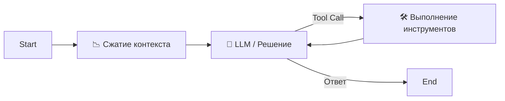

# 🤖 Smart AI Agent (Custom StateGraph + Context Summarization)

Продвинутый **AI-агент** на базе **LangGraph (Custom StateGraph)** и **Model Context Protocol (MCP)**.
Использует архитектуру с явным управлением состоянием, что позволяет вести долгие диалоги благодаря **умной суммаризации** и отображает процесс "мышления" (Chain of Thought).

Работает в **CLI** (терминал с `rich`).

---

## 🧩 Последние улучшения (качество/стабильность)

- CLI: улучшена стабильность стриминга при потоковых ответах (`AIMessageChunk`).
- CLI: ускорен парсинг `<thought>...</thought>` (предкомпилированный regex).
- Summarize Node: саммаризация формирует компактный и предсказуемый текст вместо вывода Python-объектов сообщений.
- MCP: таймаут загрузки инструментов совместим с Python < 3.11.
- File tools: корректная кроссплатформенная обработка ошибки «папка не пуста».

## ✨ Ключевые возможности

### 🧠 Интеллект и Архитектура
- **Custom StateGraph:** Прозрачный граф состояний: `Summarize` → `Agent` ⇄ `Tools`.
- **Chain of Thought (CoT):** Агент показывает свои "мысли" и планы перед выполнением действий (отображаются желтым курсивом в CLI).
- **Умная память (Context Summarization):** При превышении лимита (`SESSION_SIZE`) старые сообщения сжимаются в саммари, при этом **сохраняется структура диалога** (история всегда начинается с сообщения пользователя для совместимости с API Gemini/Anthropic).
- **Долговременная память (LTM):** ChromaDB + векторный поиск. Агент сам решает, когда сохранить (`remember_fact`), вспомнить (`recall_facts`) или забыть (`forget_fact`) информацию.

### 🛠 Инструменты и Расширяемость
- **MCP (Model Context Protocol):** Подключение любых MCP-серверов (Filesystem, Search, GitHub и др.) через конфиг `mcp.json` с поддержкой фильтрации (`enabled`).
- **Локальные инструменты:** Безопасное удаление файлов/папок (Sandbox).
- **Безопасный CLI:** 
  - Санитизация вывода (фильтрация технических тегов).
  - Стриминг токенов в реальном времени (устойчиво обрабатывает чанки сообщений).
  - **Обработка Ctrl+C:** Корректная остановка генерации без вылета из программы.

### 🔌 Интерфейсы
- **CLI:** Красивый терминал (`rich` + `prompt_toolkit`) с поддержкой истории команд, автодополнением и цветовой кодировкой инструментов.

---

## 🏗 Архитектура Графа

Вместо черного ящика, агент работает по прозрачному циклу:



1. **Summarize Node:** Проверяет длину истории. Если > `SESSION_SIZE`, сжимает старые сообщения, оставляя последние **4** для контекста.
2. **Agent Node:** Принимает решение, формирует ответ с учетом сжатой истории, текущих сообщений и системного промпта.
3. **Tools Node:** Выполняет инструменты (поиск, файлы, память) и возвращает результат агенту.

---

## 🚀 Установка

### Требования

- Python 3.10+ (рекомендуется 3.11+).

1. Клонируйте проект и создайте окружение:
   
   ```bash
   python -m venv venv
   # Windows:
   venv\Scripts\activate
   # Linux/Mac:
   source venv/bin/activate
   ```

2. Установите зависимости:
   
   ```bash
   pip install -r requirements.txt
   ```

3. Настройте `.env` (копия из `env_example`):
   
   ```ini
   # Провайдер (Gemini или OpenAI/Compatible)
   PROVIDER=gemini
   GEMINI_API_KEY=your_key
   GEMINI_MODEL=gemini-1.5-flash
   
   # Память & Контекст
   LONG_TERM_MEMORY=true
   # Порог сообщений, после которого включается суммаризация
   SESSION_SIZE=15
   ```

   Пример для **OpenAI** или **OpenAI-совместимых API** (прокси/локальные эндпоинты):

   ```ini
   # Переключаемся на OpenAI-совместимый провайдер
   PROVIDER=openai

   # Ключ (для некоторых совместимых API может быть фиктивным, но поле должно быть задано)
   OPENAI_API_KEY=your_key

   # Модель (пример: gpt-4o; для совместимых API — имя модели вашего провайдера)
   OPENAI_MODEL=gpt-4o

   # Необязательно: base_url для OpenAI-совместимых API
   # Примеры:
   # - http://localhost:11434/v1
   # - http://127.0.0.1:8000/v1
   # - https://your-proxy.example.com/v1
   OPENAI_BASE_URL=http://localhost:11434/v1

   # Память & Контекст
   LONG_TERM_MEMORY=true
   SESSION_SIZE=15
   ```

---

## 🏃‍♂️ Запуск

Запуск **CLI-агента**:

```bash
python agent_cli.py
```

### Пример MCP Конфига (`mcp.json`)
Позволяет подключать внешние инструменты. Пример для локальной файловой системы:

```json
{
  "filesystem": {
    "command": "mcp-server-filesystem",
    "args": ["{filesystem_path}"],
    "transport": "stdio",
    "enabled": true
  }
}
```

---

## 📁 Структура проекта

| Файл                | Описание                                                                 |
| ------------------- | ------------------------------------------------------------------------ |
| `agent.py`          | **Ядро.** Определение `StateGraph`, узлов (`summarize`, `agent`, `tools`) и конфигурация `Pydantic`. |
| `agent_cli.py`      | **CLI.** Асинхронный цикл с `rich`, парсинг `<thought>` тегов, обработка прерываний. |
| `logging_config.py` | Конфигурация логирования с красивым выводом через `rich` и фильтрацией шума библиотек. |
| `memory_manager.py` | Singleton-менеджер долговременной памяти (ChromaDB + Async Wrappers).    |
| `delete_tools.py`   | Безопасные асинхронные инструменты удаления файлов (sandbox).           |
| `mcp.json`          | Конфигурация MCP-серверов.                                               |
| `prompt.txt`        | Системный промпт (инструкции по формату мыслей, правилам памяти и безопасности). |
| `.env`              | Переменные окружения.                                                    |

---

## 🔧 Полезные команды в чате

- `exit` / `quit` — Выход.
- `reset` / `clear` — Полный сброс контекста (начать новую сессию с чистой историей диалога, но с сохранением LTM).
- `Ctrl + C` — Прерывание текущей генерации ответа.
- `Alt + Enter` — Перенос строки (ввод многострочного текста).

---

*© 2025. Open-source под MIT.*